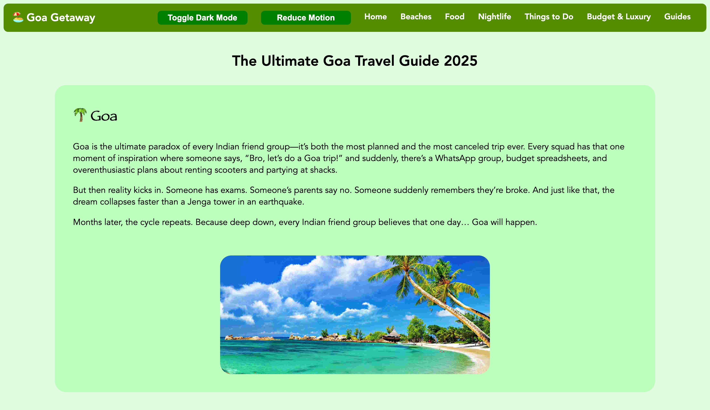
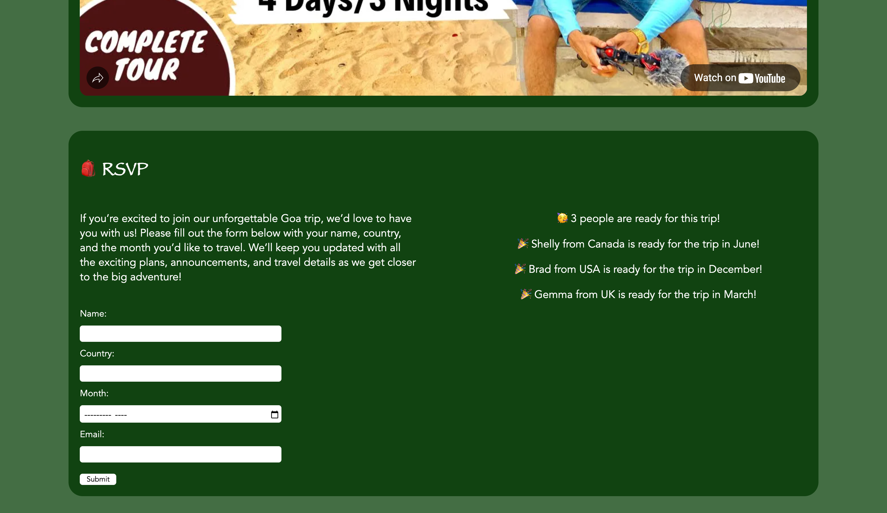

# 🏖️ Goa Getaway

Goa Getaway is a playful, travel-themed web project built for **CodePath WEB101**. It brings to life the joy — and chaos — of planning a Goa trip through **interactive designs**, **animated modals**, and **responsive storytelling**. ✨

---

## 📸 Visuals

  
  

---

## 🌴 Overview
This site captures the essence of the classic **“Goa trip” meme** — combining humor, dynamic UI, and interactive JS to mimic those spontaneous travel plans we all... almost make.  

Highlights include:
- 🎨 Responsive layout with scroll-triggered fade-in animations  
- 🌗 Light/Dark theme toggle and an optional “Reduce Motion” switch  

---

## 🚀 Features
- **📝 RSVP Form with Validation**
  - Fields for name, country, travel month, and email  
  - Invalid inputs glow red 🔴  
  - Live RSVP list + instant count updates  

- **🎭 Animated Modal Confirmation**
  - Pops up after a valid RSVP  
  - Personalized message + walking character animation 🕺  
  - Darkened backdrop with auto-close (or manual ❌ button)  

- **🧭 Navigation & Structure**
  - Responsive navbar with section links (Beaches, Food, Nightlife, etc.)  
  - Fixed footer + Flexbox-powered layouts  

- **♿ Accessibility & UX Options**
  - Light/Dark mode toggle 🌞🌙  
  - “Reduce Motion” button to keep it chill 💤  

- **🍹 Rich Content Sections**
  - **😂 Humorous Intro** riffing on Indian Goa trip plans  
  - **🏝️ Destinations, 🍲 Food, 🎉 Nightlife, 🚗 Activities, 📖 Travel Guides**  
  - **💸 Budget vs Luxury** tips for every kind of traveler  

- **✨ Extras**
  - Embedded travel video 🎬  
  - Custom favicon 🌟  
  - Fun CTAs like **“Explore More”** & **“Book Now”**  

---

## 💻 JavaScript Concepts Used
- `getElementById()`, `addEventListener()`  
- Dynamic CSS tweaks (`style.display`, `backgroundColor`, `transform`)  
- CSS `@keyframes`, `setInterval()`, `setTimeout()` for animations ⏳  
- Form validation logic ✅❌  

---

## ⚖️ License

    Copyright [2025] [Kelvin Mathew]

    Licensed under the Apache License, Version 2.0 (the "License");
    you may not use this file except in compliance with the License.
    You may obtain a copy of the License at

        http://www.apache.org/licenses/LICENSE-2.0

    Unless required by applicable law or agreed to in writing, software
    distributed under the License is distributed on an "AS IS" BASIS,
    WITHOUT WARRANTIES OR CONDITIONS OF ANY KIND, either express or implied.
    See the License for the specific language governing permissions and
    limitations under the License.
